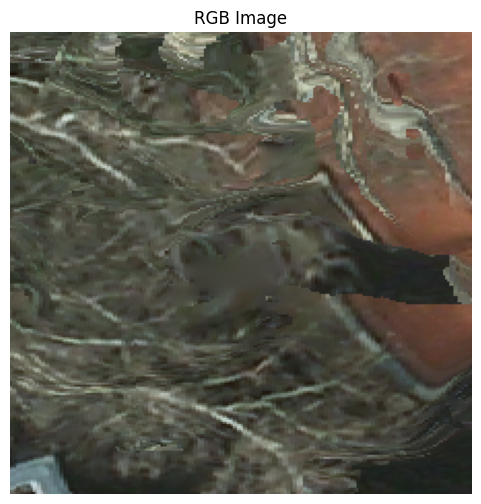
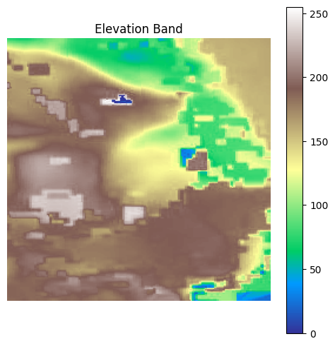
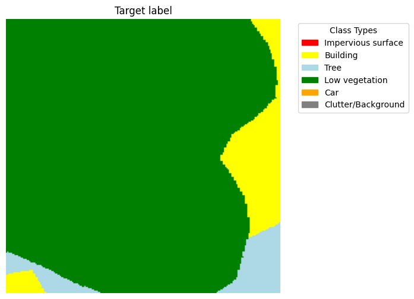
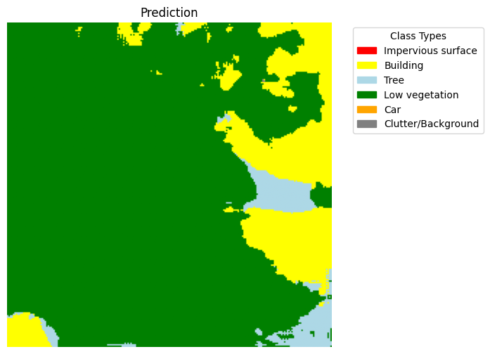

# Semantic Segmentation on the Potsdam Dataset

This repository contains an implementation of semantic segmentation models trained on the **2D Semantic Labeling Potsdam dataset**. The project explores two different deep learning approaches for pixel-wise classification of aerial imagery: a **simple convolutional model** and an **encoder–decoder architecture**.

The goal is to segment aerial images into six semantic classes:

- Impervious surface  
- Building  
- Tree  
- Low vegetation  
- Car  
- Clutter/Background  

---

## Dataset

The dataset consists of GeoTIFF image tiles with a spatial resolution of **5 cm per pixel**. Each tile has dimensions of **224 × 224 pixels** and contains six bands:

- Red  
- Green  
- Blue  
- Infrared (IR)  
- Elevation  
- Target label band (semantic classes)

For computational feasibility, **5,000 images** were randomly sampled from the full dataset of **15,048 tiles**.

The dataset was split into **five folds**:

| Fold | Usage |
|-----|------|
| 1–3 | Training |
| 4 | Validation |
| 5 | Test |

To improve training efficiency, the dataset was stored in **TFRecord format** and loaded using the TensorFlow `tf.data` pipeline.

---

## Models

### Simple Convolutional Model

A baseline semantic segmentation model consisting of two convolutional layers followed by a softmax classifier.  
This model uses **RGB and IR bands** as input and serves as a reference for performance comparison.

---

### Encoder–Decoder Model

A more advanced **encoder–decoder architecture** was implemented using all five input bands:

- RGB
- Infrared
- Elevation

The encoder progressively downsamples the spatial resolution to extract high-level features, while the decoder reconstructs the segmentation map using **transposed convolutions and skip connections**.

---

## Training

Both models were trained for **20 epochs** using:

- **Categorical Cross-Entropy Loss**
- **Adam Optimizer**

Data augmentation was applied during training to improve generalization:

- Random horizontal flips  
- Random vertical flips  
- Random 90° rotations  

The best model was selected based on **validation loss** using model checkpointing.

---

## Results

The encoder–decoder architecture significantly outperformed the simple convolutional model.

| Model | Test Loss | Test Accuracy |
|------|-----------|---------------|
| Simple CNN | 0.924 | 63.4% |
| Encoder–Decoder | 0.632 | 77.2% |

---

## Example predictions

Below are examples of model predictions compared to the ground truth.

### RGB Image

### Elevation Band

### Ground Truth Segmentation

### Model Prediction

---

## Technologies used

- Python  
- TensorFlow / Keras  
- NumPy  
- Matplotlib  
- Rasterio  

---

## Authors

This project was implemented in Design of AI Systems in Chalmers, by:

**Josue Valenzuela Perez**  
**Ludwig Alexandersson**
